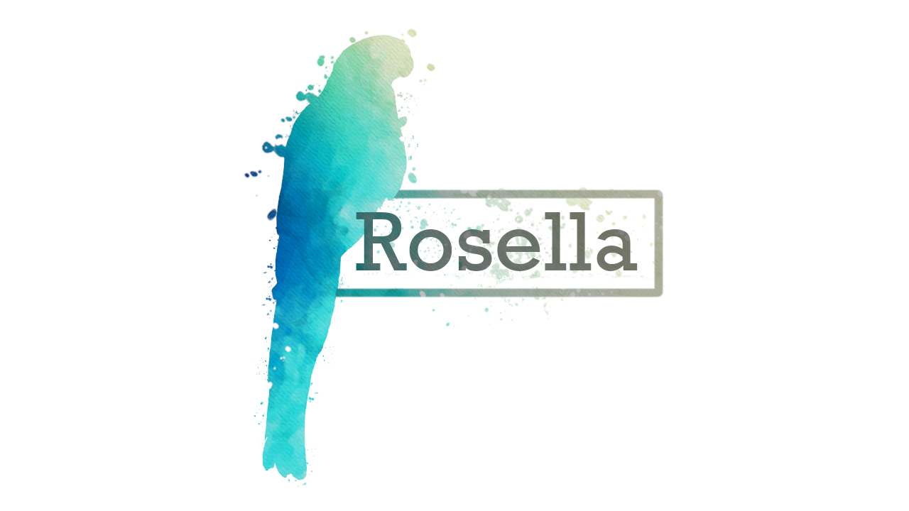

# Rosella
Rosella is a metagenomic binning algorithm using UMAP and HDBSCAN. It is written in Rust with a python component that 
handles calls to UMAP and HDBSCAN. Rosella aims to be as user friendly as possible with multiple usage modes and installation
methods. 

Please note that Rosella is under active development with new commits often providing much improved results. If you would like
the most up to date version of Rosella please pull the code from `dev` branch. Hopefully releases will stabilise very soon.

## Quick Install
*`flight` must be installed from GitHub at the moment due to difficulties with `pynndescent`*
```
conda install -c bioconda rosella
git clone https://github.com/rhysnewell/flight.git
cd flight
pip install .
rosella --version
```

## Documentation

Please refer to [documentation](https://rhysnewell.github.io/rosella) for installation and usage instructions.
