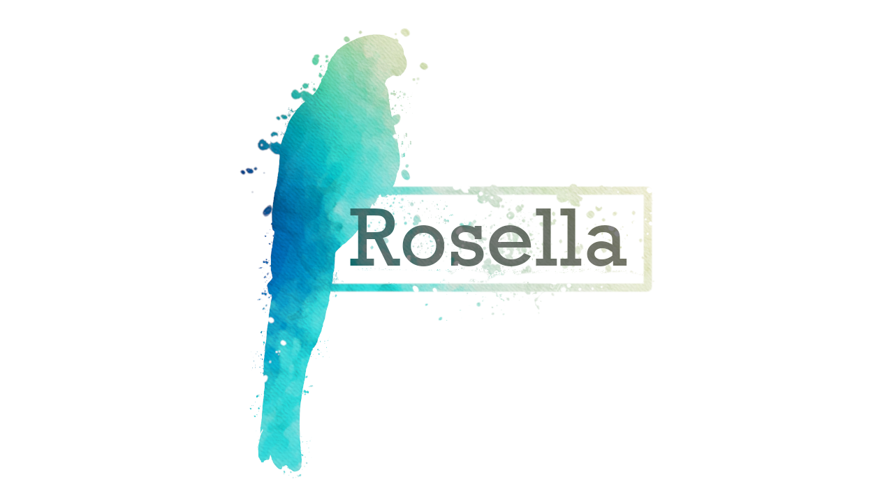

[](http://bioconda.github.io/recipes/rosella/README.html)


[](https://zenodo.org/doi/10.5281/zenodo.10140531)



# Rosella
Rosella recovers genomes from a metagenome assembly by partitioning a k-nearest-neighbour graph over contig composition and coverage. Contigs are joined into a fuzzy simplicial set, the graph is cut with Leiden and label propagation across a ladder of resolutions, single-copy markers arbitrate which cut each bin takes, and the bins that miss the bar go back into a pool to be searched again. It is written entirely in Rust, with no
Python component and no external binning dependency.

Two tools are called out to. `hmmsearch` searches the single-copy markers and is always needed.
`coverm` computes coverage, and is only called when you do not pass `--coverage-file`. The genes
are called in process, so there is no gene caller to install.

```bash
rosella recover -r assembly.fasta -C coverage.tsv -o rosella_bins/ -t 24
```

Rosella is under active development and its results move between commits.

## Quick Install
## Option 1: Conda

It's recommended that you create a new environment to ensure conda can correctly handle of the rosella's dependencies:

```bash
conda create -n rosella -c bioconda rosella
conda activate rosella
rosella --version
```

## Option 2: Install manually
With `rust` and `cargo` installed on your system
```bash
git clone --recursive https://github.com/rhysnewell/rosella
cd rosella
cargo install --path .
```

Create the conda environment
```bash
mamba env create -f rosella.yml -n rosella
mamba activate rosella
rosella --help
```

## Option 3: Using pixi
If you have [pixi](pixi.sh) installed you can install rosella with:
```bash
git clone --recursive https://github.com/rhysnewell/rosella
cd rosella
cargo install --path .
pixi shell
rosella --help
```

## Documentation

Please refer to [documentation](https://rhysnewell.github.io/rosella) for installation and usage instructions.

## Benchmarks

The benchmark harness, the recovered historical baselines and the CAMI datasets live in a
separate project, `01-rosella-benchmarks`, so this repository stays a Rust codebase.

## License

Rosella is licensed under the GNU General Public License v3.0 only. See [LICENSE](LICENSE).

Copyright (c) 2020, Centre for Microbiome Research, QUT
