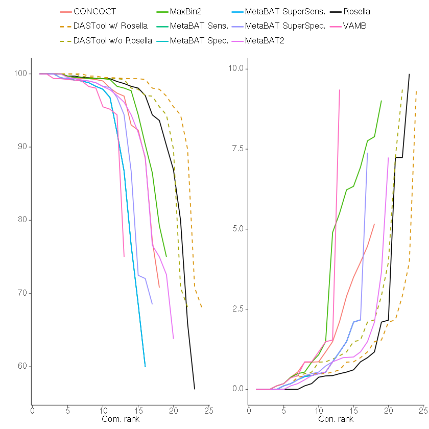

# Rosella
A metagenomic binner and variant clusterer using UMAP and HDBSCAN on compositonal datasets

# Installation
#### Option 1: Conda
This is the easiest method:

```
conda install -c bioconda rosella
rosella --version
```

It's recommended that you create a new environment to ensure conda can correctly handle of the rosella's dependencies:

```
conda create -n rosella -c bioconda rosella
conda activate rosella
rosella --version
```

#### Option 2: Install manually
You may need to manually set the paths for `C_INCLUDE_PATH`, `LIBRARY_PATH`, `LIBCLANG_PATH`, 
`LD_LIBRARY_PATH`, and `OPENSSL_DIR` to their corresponding
paths in your conda environment if they can't properly be found on your system.
```

git clone --recursive https://github.com/rhysnewell/rosella.git \ 
cd rosella \
conda env create -n rosella -f rosella.yml \ 
conda activate rosella \ 
bash install.sh # or e.g. `cargo run -- bin`
```

Depending on your local network configuration, you may have problems obtaining rosella via git.
If you see something like this you may be behind a proxy that blocks access to standard git:// port (9418).

```
$ git clone --recursive git://github.com/rhysnewell/rosella.git
Cloning into 'rosella'...
fatal: Unable to look up github.com (port 9418) (Name or service not known)
```

Luckily, thanks to this handy tip from the developer of [Freebayes](https://github.com/ekg/freebayes) we can work around it.
If you have access to https:// on port 443, then you can use this 'magic' command as a workaround to enable download of the submodules:

```
git config --global url.https://github.com/.insteadOf git://github.com/
```

# Requirements

Initial requirements for rosella can be downloaded using the `rosella.yml`:
```
conda env create -n rosella -f rosella.yml
```

# Usage

Rosella can be run multiple different ways in order to make using it as easy as possible.

#### Option 1: Precomputed coverage values

The most likely situation is that you are running rosella in conjunction with other
binning algorithms, like metabat2. If so, then you likely already have coverage values precomputed
using `coverm contig` using `-m metabat`.

To perform mag recovery:
```
rosella bin -r scaffolds.fasta --coverage-values coverm.cov -o rosella_bin/ -t 24
```

#### Option 2: Use rosella to get coverage values

If you have yet to run `CoverM` then rosella can generate the coverage values for you!
This is especially useful if you have both long and short reads as they can be passed
to rosella in tandem. Don't be afraid to pass multiple samples at once to rosella either,
it can handle it and keep everything in order.

```
rosella bin -r scaffolds.fasta -1 short_s[12345].1.fastq.gz -2 short_s[12345].2.fastq.gz --longreads nanopore.fastq.gz -o rosella_bins/
```

You can keep the BAM files that are created by rosella by including the `--bam-file-cache-directory`
flag. Once the coverage values are calculated, they will be stored in the output direcotry along with
the kmer frequency file.

#### Option 3: Use previous results

If you have previously run rosella and something happened like a crash but the coverage values have
already been calculated and stored in your provided output directory then you are safe.
Just run rosella by giving it your output directory and watch as it sorts everything out for you.

```
rosella bin -r scaffolds.fasta -o rosella_bins/ -t 24
```

Rosella checks for previous results by default, but this behaviour can be overridden if you'd like fresh coverage
values by passing the `--force` flag.

# Output

The main output for rosella will be a set of MAGs denoted `rosella_bin_X.fna`. How many bins you get depends on your 
samples. Additionally, the kmer frequency table will be present: `rosella_kmer_table.tsv`. And the coverage values if
they were calculated by rosella: `rosella_coverage_values.tsv`. Finally, you'll get a pretty UMAP projection plot coloured
by potential MAG clusters. This plot isn't necessary but it helps you interpret how well rosella partitioned out your contigs.
If you see only a couple of big noisy clusters then maybe something went wrong and you'll want to fiddle with a few of
the UMAP parameters. This is unlikely though, but if you feel like you do need to then please feel free to raise an issue
on this GitHub and I'll answer your question and add my respone to the FAQ to help other users.

# Performance

*The following is  breakdown of some preliminary rosella results. This is in now way suggesting you should
use rosella over other tools, instead it is meant to make you consider using rosella in conjunction with other tools.
Each binner has strengths and weaknesses, and when used together via DASTool it is their joint strengths that begin
to shine rather than their weaknesses.*

Testing and benchmarking for rosella is still underway, but the initial results look pretty good. 
Comparing performance on the CAMI one low, medium, and high complexity datasets shows that rosella compares as well as, 
if not better than other binning tools. In the high complexity dataset this even includes DASTool which is a combination 
of the results of all the other binners except for VAMB and rosella. 

The results of each benchmark is posted below. Each bin set was filtered down to only include bins that had >=50% 
Completeness and <=10% Contamination based on the results of `checkm lineage_wf` v1.1.2. 
The bins were than ranked by their completeness and contamination values separately and the results plotted.

### CAMI Low



Here rosella performs about as well as every other single binning tool.

### CAMI Medium


Here rosella begins to pull ahead and generate more bins of higher quality than
the other single binning techniques. DASTool still results in the best results
but the inclusion of rosella in the DASTool algorithm would only be beneficial.

### CAMI High


Here we rosella really take flight, outperforming even DASTool.


### CAMI metagenomes breakdown

| Community | Samples  |   | Inputs |   |
|---|---|---|---|---|
|   | Short read | Long read | Total Gbp | Genomes | Circular elements |
|   CAMI Low	| 1	| 0	| 15 | 40 | 20   |
|   CAMI Med	| 4	| 0	| 40 | 132 | 100 |
|   CAMI High	| 5	| 0	| 75 | 596 | 478 |

# FAQs

Your feedback and input helps me as a developer create better tools for you. So please, if you have any questions
raise them as an issue on this GitHub. If I feel like it is an issue others might frequently have then I'll place my 
response here.

# Resources

Rosella makes use of a couple new and daunting algorithms. UMAP in particular is an amazing algorithm but might be cause 
for concern since it is difficult to understand how it works and what it is doing. So please look over this amazing article 
by Andy Coenen and Adam Pearce: [Understanding UMAP](https://pair-code.github.io/understanding-umap/)

# Citation

*Watch this space* A paper is on its way. If you use rosella and like the results before the paper, then please cite this GitHub
