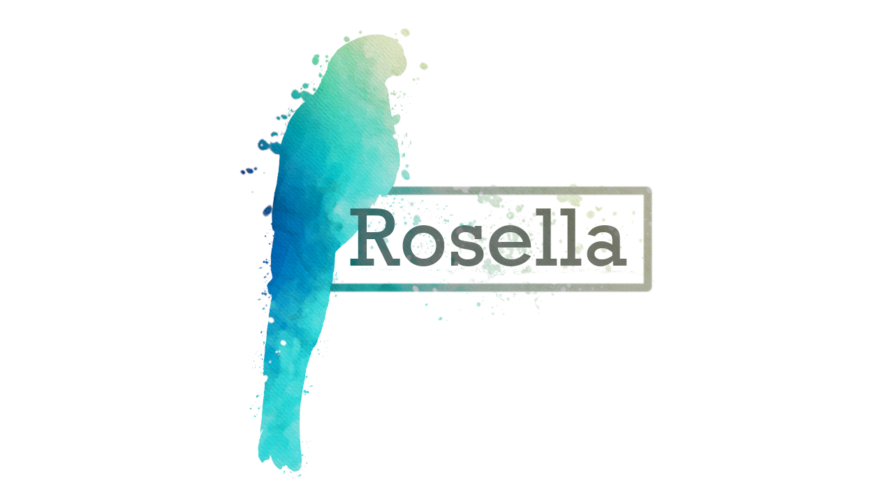

Rosella
=============

Rosella recovers genomes from a metagenome assembly by partitioning a k-nearest-neighbour graph over contig composition and coverage. Contigs are joined into a fuzzy simplicial set, the graph is cut with Leiden and label propagation across a ladder of resolutions, single-copy markers arbitrate which cut each bin takes, and the bins that miss the bar go back into a pool to be searched again. It is written entirely in Rust,
with no Python component.

Rosella is under active development and its results move between commits.

## Additional resources

The neighbour graph is weighted as a fuzzy simplicial set, after McInnes, Healy and Melville
(2018). The low dimensional layout that method is best known for is not part of the default
path; only the graph is. For the intuition behind the graph, see [Understanding UMAP](https://pair-code.github.io/understanding-umap/)
by Andy Coenen and Adam Pearce.

The partition itself is Leiden (Traag, Waltman and van Eck, 2019) and label propagation, each
run across a ladder of resolutions and ranked on the map equation codelength.

## Citation

*Watch this space* A paper is on its way. If you use rosella and like the results before the paper, then please cite this GitHub

## License

Code is [GPL-3.0](LICENSE)