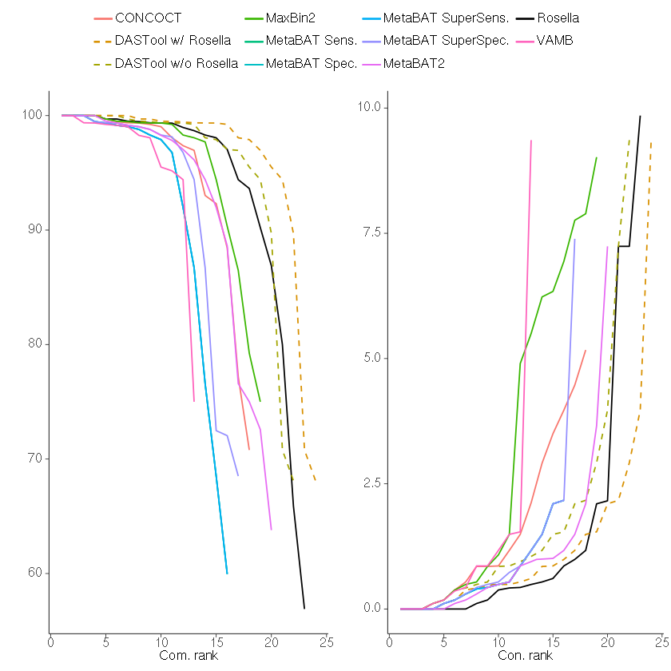
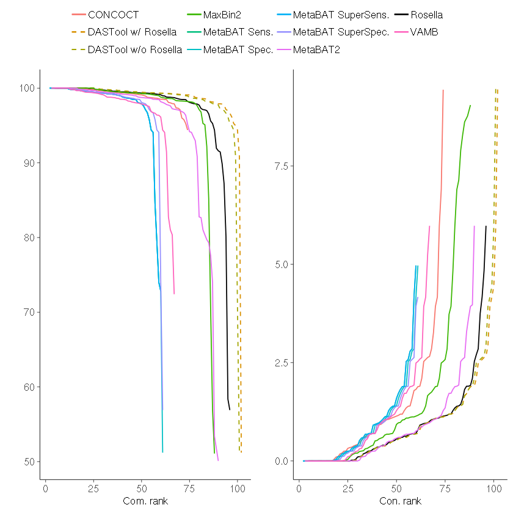
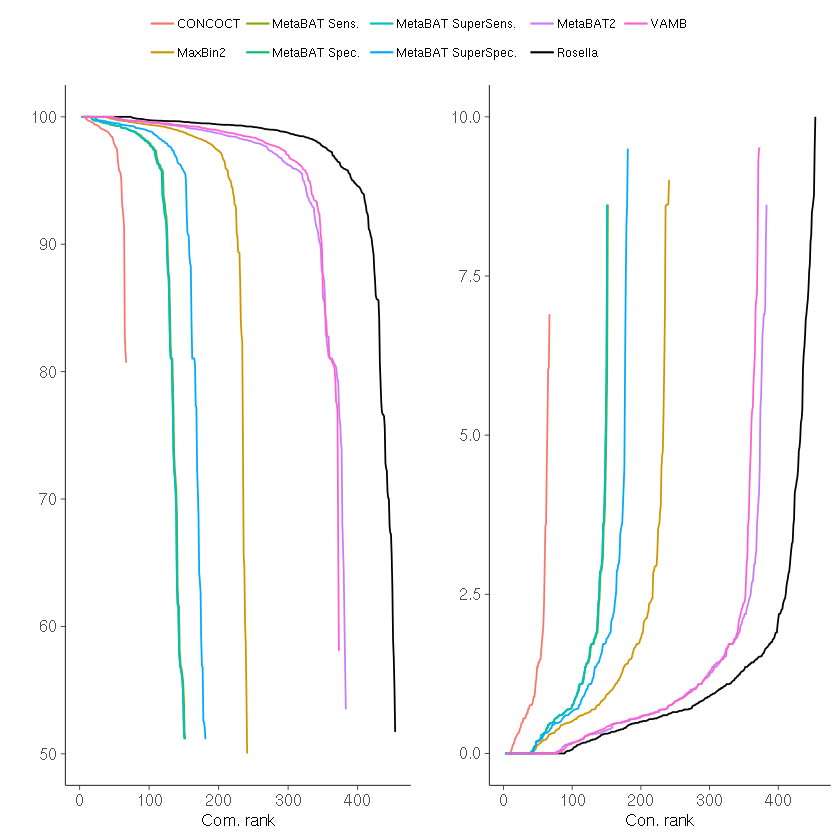

Performance
========

> **These figures are historical.** They come from rosella around 0.4.x and score bins
> with `checkm lineage_wf` v1.1.2, which estimates completeness and contamination from
> marker genes rather than measuring them against the CAMI gold standard. The underlying
> data was not kept, and CheckM1 v1.1.2 is no longer practically installable, so these
> plots cannot be reproduced or extended. Treat them as a record of what was claimed at
> the time, not as a baseline for current work.
>
> For the current method, and for the gold standard numbers that were recovered from the
> original analysis notebooks, see the `01-rosella-benchmarks` project.

*The following is  breakdown of some preliminary rosella results. This is in now way suggesting you should
use rosella over other tools, instead it is meant to make you consider using rosella in conjunction with other tools.
Each binner has strengths and weaknesses, and when used together via DASTool it is their joint strengths that begin
to shine rather than their weaknesses.*

Testing and benchmarking for rosella is still underway, but the initial results look pretty good.
Comparing performance on the CAMI one low, medium, and high complexity datasets shows that rosella compares as well as,
if not better than other binning tools. In the high complexity dataset this even includes DASTool which is a combination
of the results of all the other binners except for VAMB and rosella.

The results of each benchmark is posted below. Each bin set was filtered down to only include bins that had >=50%
Completeness and <=10% Contamination based on the results of `checkm lineage_wf` v1.1.2.
The bins were than ranked by their completeness and contamination values separately and the results plotted.

### CAMI Low

Here Rosella manages to outperform every other independent binning algorithm.

### CAMI Medium

Here rosella generates more bins of higher quality than
the other single binning techniques. DASTool still results in the best results
but the inclusion of rosella in the DASTool algorithm would only be beneficial.

### CAMI High

Here we rosella really take flight, outperforming even DASTool.

### CAMI metagenomes breakdown

| Community | Samples  |   | Inputs |   |
|---|---|---|---|---|
|   | Short read | Long read | Total Gbp | Genomes | Circular elements |
|   CAMI Low	| 1	| 0	| 15 | 40 | 20   |
|   CAMI Med	| 4	| 0	| 40 | 132 | 100 |
|   CAMI High	| 5	| 0	| 75 | 596 | 478 |